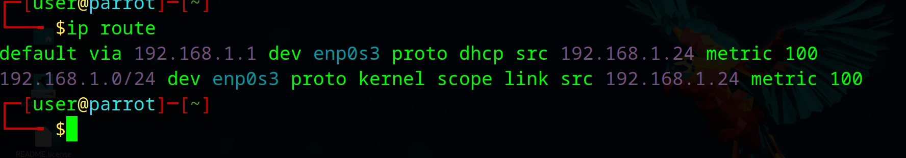
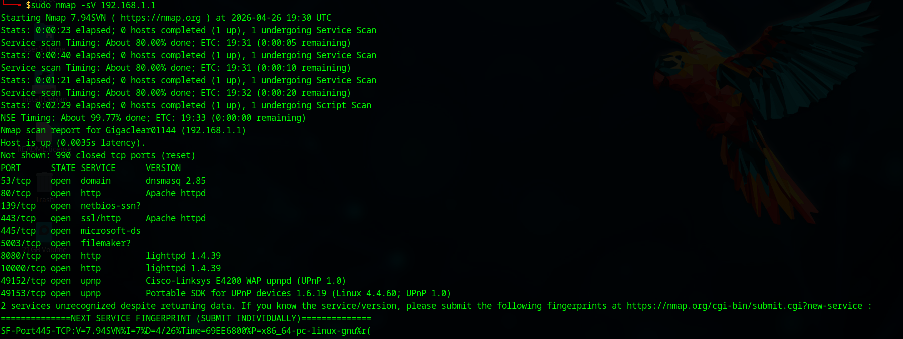

**1.Objective**

The aim of this project is to perform a network scan on the default gateway of the network to determine what ports are open, and the respective service versions, as well as to determine the overall attack surface of the network and any areas of concern. This project will demonstrate proficiency in utilizing nmap and how industry professionals might map out a network.

**2.Setup**

Operating system: Parrot Security (running as a VM through OracleBox on a Windows 11 machine)  
Tools: Network mapper(Nmap)  
Target: default gateway (192.168.1.1)  
Network environment: Bridged adapter(Ensuring an appropriate connection is being made through the VM)

**3.Process**

* ***Target Identification*** using 'IP route' in the Parrot CLI to identify the default gateway IP (192.168.1.1) and the local IP address (192.168.1.24).
* ***Version and Service Identification*** Leveraged the '-sV' nmap scan in order to determine services and their version numbers as opposed to a traditional nmap scan that only includes ports.
* ***OS fingerprinting*** Utilized the '-O' nmap scan in order to determine the OS running on the network gateway and the underlying service version running.

**4.Findings**
* ***Open Ports***
  * ****Port 53(DNS)**** DNS service running as 'dnsmasq 2.85'.
  * ****Port 80/443(HTTP/S)**** Services running listed as apache httpd, this is likely hosting the web management interface.
  * ****Port 445(SMB)**** running Microsoft-DS, suggesting file sharing capabilities.
  * ****Port 49152/49153(UPnP)**** Identified as a Cisco-Linksys wireless access point. Linksys routers are the standard routers supplied by my ISP.
* ***Hardware and Operating System ***
    * The scan shows the hardware running the network gateway is manufactured by Belkin International
    * OS fingerprinted as Linux (Kernel 3.2-4.9)
    * The MAC address was also identified in the scan but has been redacted from the images.
* ***Topology*** Confirmed a network distance of 1 hop, Evidence of a direct connection to the gateway.
 

**5.Explanation**

This project highlights an integral phase of any security audit __**Enumeration**__ Identifying that the router is running services that we have names for, like dnsmasq 2.85 and apache, a security professional can cross-reference these with known CVEs in order to identify potential exploits. Additionally, the presence of UPnP and SMB services is evidence of an increased internal attack surface, which would absolutely require diligent patch and credential management. This project demonstrates an understanding of the importance of Enumeration in security auditing

**6. Screenshots/Evidence**

 

Screenshot of the parrot CLI showing the 'ip route command' in order to confirm the IP address of the target(default gateway)

 

Output using the '-sV' nmap function displaying DNS, Apache, and UPnP services

 

Scan using the '-O' Nmap function, which displays the target OS, in this case Linux, and the Belkin Industries hardware manufacturer.

